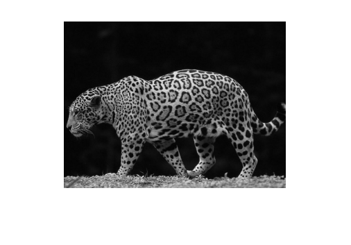
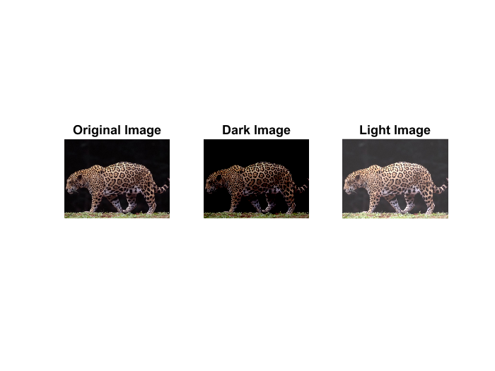
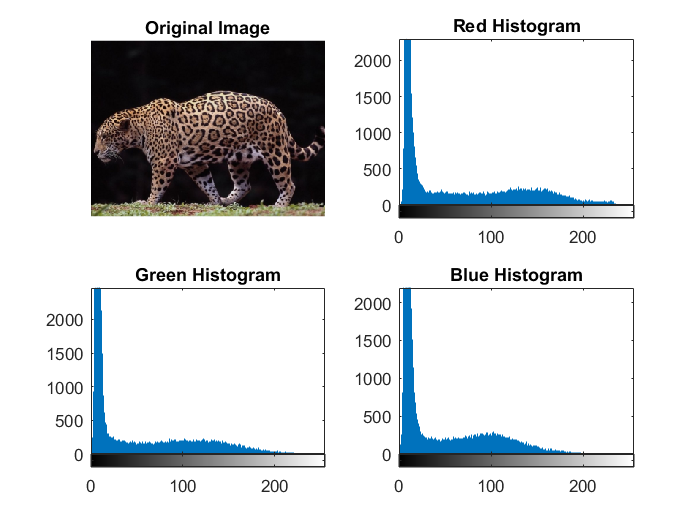

# Basic Operations on Images

### Get grayscale image

```matlab
img = imread('Jaguar.bmp');
grayImg = rgb2gray(img);
```



### Make the image brighter/darker

```matlab
img = imread('Jaguar.bmp');
brightImg = img + 50;
darkImg = img - 50;
```



### Extracting the red, green, and blue channels/histograms from an image

```matlab
img = imread('Jaguar.bmp');
redImg = img(:, :, 1);
greenImg = img(:, :, 2);
blueImg = img(:, :, 3);

redHist = imhist(redImg);
greenHist = imhist(greenImg);
blueHist = imhist(blueImg);
```

