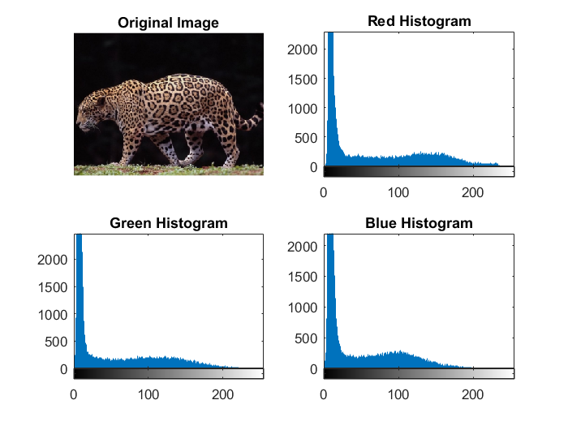
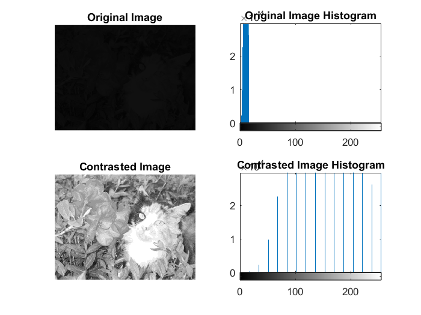
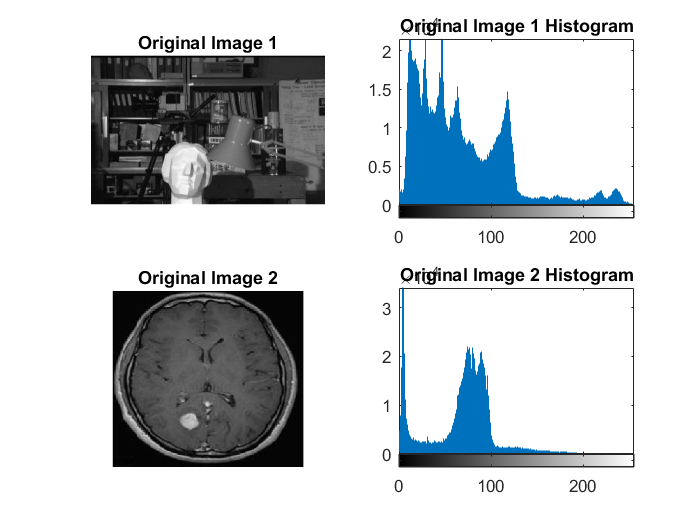
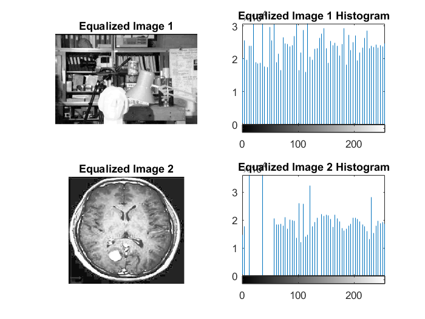
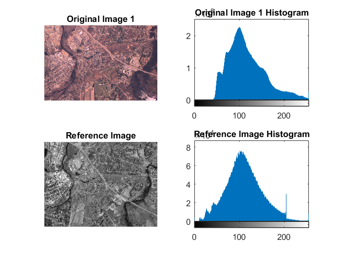
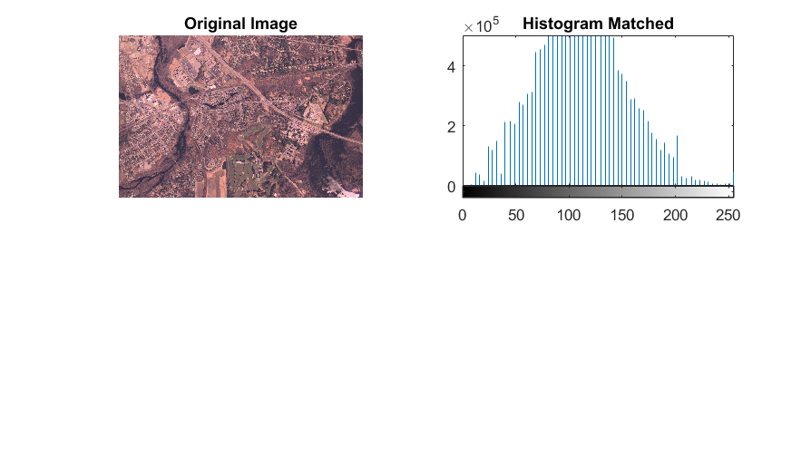

# Lab 3: Image Enhancement

## Histogram Equalization

```matlab
% Display the histograms of the RGB channels separately from image “Jaguar.bmp”.
img = imread('images/Jaguar.bmp');
figure;
subplot(2,2,1),imshow(img), title('Original Image');
subplot(2, 2,2),imhist(img(:,:,1)), title('Red Histogram');
subplot(2,2,3),imhist(img(:,:,2)), title('Green Histogram');
subplot(2,2,4),imhist(img(:,:,3)), title('Blue Histogram');
```



## Contrast Stretching

```matlab
% Implement Contrast method that apply contrast stretching technique
img = imread('images/ContrastDark.bmp');
figure;
subplot(2,2,1),imshow(img), title('Original Image');
subplot(2,2,2),imhist(img), title('Original Image Histogram');

img = Contrast(img, 0, 255);
subplot(2,2,3),imshow(img), title('Contrasted Image');
subplot(2,2,4),imhist(img), title('Contrasted Image Histogram');
```



### Histogram Equalization

```matlab
% Apply histogram equalization on image “Unequalized_1.jpg” or “Unequalized_2.png” and 
img1 = imread('images/Unequalized_1.jpg');
img2 = imread('images/Unequalized_2.PNG');

figure;
subplot(2,2,1),imshow(img1), title('Original Image 1');
subplot(2,2,2),imhist(img1), title('Original Image 1 Histogram');
subplot(2,2,3),imshow(img2), title('Original Image 2');
subplot(2,2,4),imhist(img2), title('Original Image 2 Histogram');

img1 = histeq(img1);
img2 = histeq(img2);

figure;
subplot(2,2,1),imshow(img1), title('Equalized Image 1');
subplot(2,2,2),imhist(img1), title('Equalized Image 1 Histogram');
subplot(2,2,3),imshow(img2), title('Equalized Image 2');
subplot(2,2,4),imhist(img2), title('Equalized Image 2 Histogram');
```



## Histogram Matching

```matlab
% Apply histogram matching on image “concordaerial.png” with reference image “concordorthophoto.png” 
img1 = imread('images/concordaerial.png');
refImg = imread('images/concordorthophoto.png');
figure;
subplot(2,2,1),imshow(img1), title('Original Image 1');
subplot(2,2,2),imhist(img1), title('Original Image 1 Histogram');
subplot(2,2,3),imshow(refImg), title('Reference Image');
subplot(2,2,4),imhist(refImg), title('Reference Image Histogram');

% Apply histogram matching
imghist = imhistmatch(img1, refImg);
figure;
subplot(2,2,1),imshow(img1), title('Original Image');
subplot(2,2,2),imhist(imghist), title('Histogram Matched');
```

