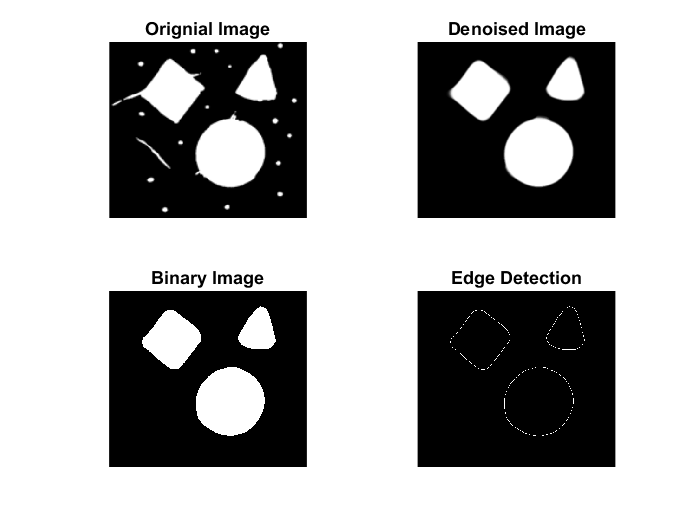

# Edge Detection and Noise Removal

- Noise Removal : `medfilt2(grayImg, [size, size])`
- Edge Detection : `edge(binaryImg, 'sobel')`


Extract the boundary pixels of the 3 main objects only and remove all noise.

```matlab
%  Edge Detection + Noise removal
img = imread('Filters.png');
subplot(2,2,1), imshow(img), title('Orignial Image');

% Convert the original image to grayscale
grayImg = rgb2gray(img);

% Apply median filtering to remove noise from the grayscale image
denoisedImg = medfilt2(grayImg, [30, 30]);
subplot(2, 2, 2), imshow(denoisedImg), title('Denoised Image');

% Convert the denoised image to a binary image
binaryImg = im2bw(denoisedImg);
subplot(2, 2, 3), imshow(binaryImg), title('Binary Image');

% Apply edge detection using the Sobel operator on the binary image
edgeImg = edge(binaryImg, 'sobel');
subplot(2, 2, 4), imshow(edgeImg), title('Edge Detection');
```


