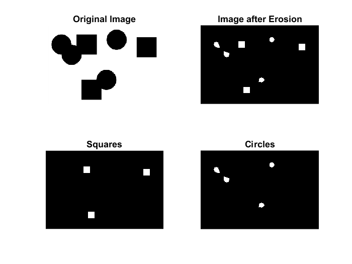
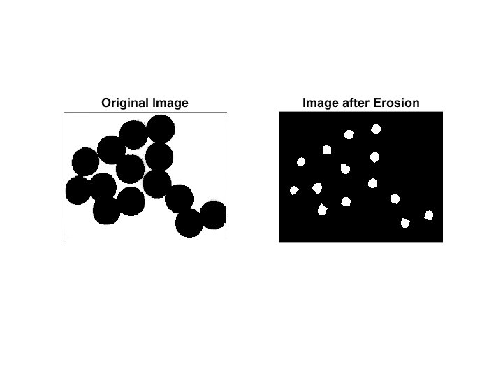
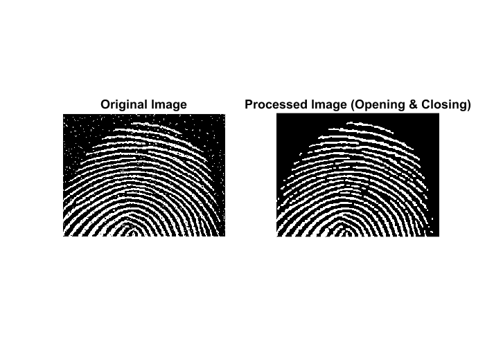
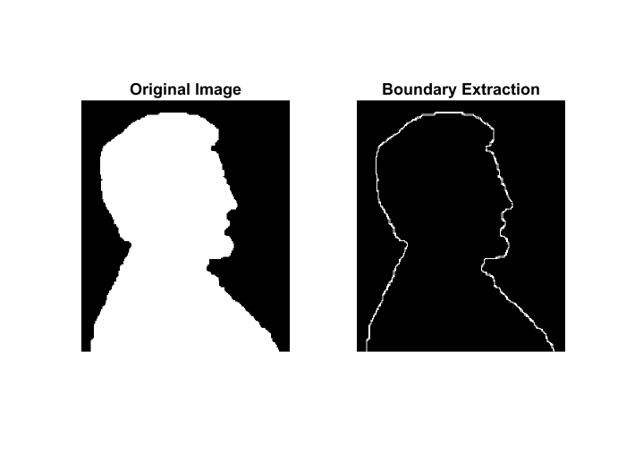
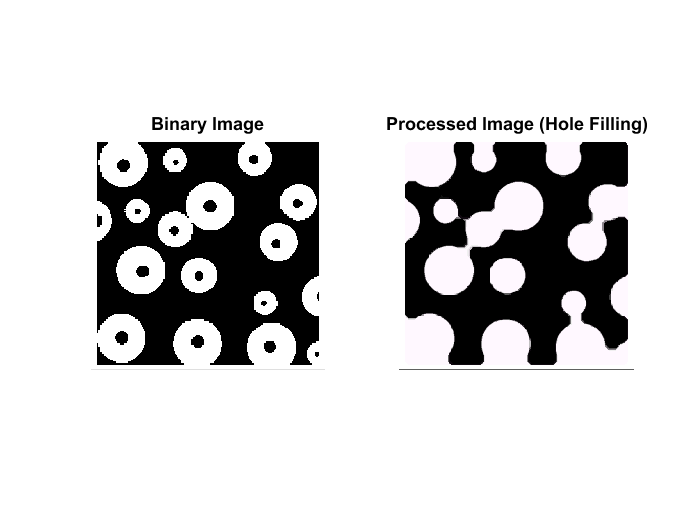

# Count different objects in an image

- Square rectangularity = 1
- Circle rectangularity = 0.6 - 0.85

```matlab
% Read the image
img = imread('shapes.png');

% Convert the image to grayscale
grayImg = rgb2gray(img);

% Convert the grayscale image to a binary image
threshold = graythresh(grayImg);
binaryImg = im2bw(grayImg, threshold);
binaryImg = ~binaryImg;  % Invert the binary image

% Extract disks (circles) using morphological operations
% The higher the number, the smaller the resulting circles
diskSize = 20;
se = strel('disk', diskSize);

% Erosion operation
erodedImg = imerode(binaryImg, se);

% Count the number of connected components
[L, comCount] = bwlabel(erodedImg);

% Display the number of components in the command window
disp(['Number of components: ', num2str(comCount)]); % Number of components: 7


% Identify and Count Squares
%  the 'Extent' represents the ratio of the area of the region to the area of the bounding box. 
stats = regionprops(L, 'Extent'); 
rectangularity = [stats.Extent];

squares = find(rectangularity == 1);
numofsquares = length(squares);

% Identify and Count Circles
circles = find(rectangularity > 0.6 & rectangularity < 0.85);
numofcircles = length(circles);

disp(['Number of squares: ', num2str(numofsquares)]); % Number of squares: 3
disp(['Number of circles: ', num2str(numofcircles)]); % Number of circles: 4


% Create a binary image for squares
square_image = zeros(size(L));
for i = squares
    square_image(L == i) = true;
end

% Create a binary image for circles
circle_image = zeros(size(L));
for i = circles
    circle_image(L == i) = true;
end


% Visualization
figure;
subplot(2, 2, 1), imshow(img), title('Original Image');
subplot(2, 2, 2), imshow(erodedImg), title('Image after Erosion');
subplot(2, 2, 3), imshow(square_image), title('Squares');
subplot(2, 2, 4), imshow(circle_image), title('Circles');
```




----------------------------------------------------------

# Count the number of disks (circles) in an image

- `se = strel('disk', diskSize)`
- `erodedImg = imerode(binaryImg, se)`
- `[labeledImg, circleCount] = bwlabel(erodedImg)`

```matlab
% Read the image
img = imread('spheres.png');

% Convert the image to grayscale
grayImg = rgb2gray(img);

% Convert the grayscale image to a binary image
threshold = graythresh(grayImg);
binaryImg = im2bw(grayImg, threshold);
binaryImg = ~binaryImg;  % Invert the binary image

% Extract disks (circles) using morphological operations
% The higher the number, the smaller the resulting circles
diskSize = 25;
se = strel('disk', diskSize);

% Erosion operation to enhance circular structures
erodedImg = imerode(binaryImg, se);

% Count the number of connected components (circles)
[labeledImg, circleCount] = bwlabel(erodedImg);

% Display the number of circles in the command window
disp(['Number of circles: ', num2str(circleCount)]);

% Visualization
figure;
subplot(1, 2, 1), imshow(img), title('Original Image');
subplot(1, 2, 2), imshow(erodedImg), title('Image after Erosion');
```



----------------------------------------------------------

# Remove noise & fix small cuts/holes in fingerprint

```matlab
% Remove noise & fix small cuts/holes in fingerprint

% Read the image
img = imread('fingerprint.png');

% Define a structuring element
se = strel('square', 3);

% Perform opening and closing operations
op = imopen(img, se);
cl = imclose(op, se);

% Visualization
figure;
subplot(1, 2, 1), imshow(img), title('Original Image');
subplot(1, 2, 2), imshow(cl), title('Processed Image (Opening & Closing)');
```



# Boundary Extraction using structuring elements

```matlab
% Boundary Extraction using a 3×3 structure element.

% Read the image
img = imread('man.png');

% Convert the image to grayscale
grayImage = rgb2gray(img);

% Define a 3x3 structuring element
se = strel('square', 3);

% Perform erosion and calculate the boundary
erodedImage = imerode(grayImage, se);
boundaryImage = grayImage - erodedImage;

% Perform dilation
dilatedImg = imdilate(boundaryImage, se);

% Visualization
figure;
subplot(1, 2, 1), imshow(img), title('Original Image');
subplot(1, 2, 2), imshow(dilatedImg), title('Boundary Extraction');
```



----------------------------------------------------------

# Hole Filling

```matlab
% Hole Filling

% Read the grayscale image
img = imread('holes.png');

% Define a disk-shaped structuring element
se = strel('disk', 17);

% Perform closing operations
filledImage = imclose(img, se);

% Visualization
figure;
subplot(1, 2, 1), imshow(binaryImage), title('Binary Image');
subplot(1, 2, 2), imshow(filledImage), title('Processed Image (Hole Filling)');
```



----------------------------------------------------------