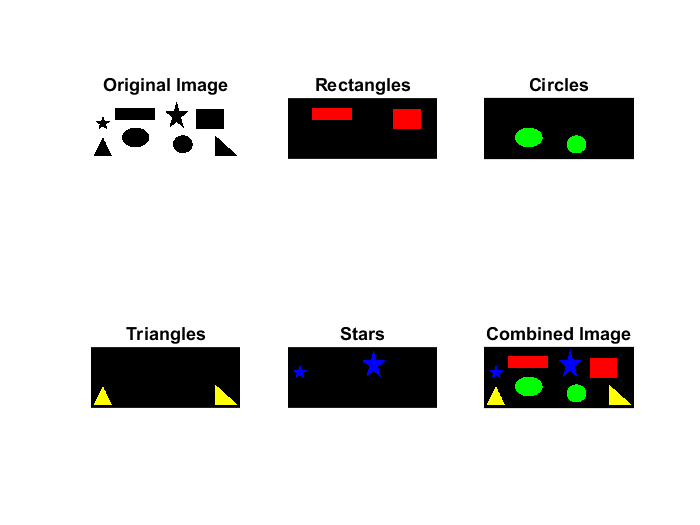

# Extract shapes and color each shape with a different color

- Square Rectangaularity: 1
- Circle Rectangaularity: 0.6 - 0.85
- Triangle Rectangaularity: 0.5 - 0.6
- Star Rectangaularity: < 0.5


```matlab
% Extract shapes and color each shape different

% Read the image
img = imread('TestCase1.png');

% Convert to grayscale and invert
grayImg = rgb2gray(img);
grayImg = ~grayImg; % Invert

% Label connected components
[L, num] = bwlabel(grayImg);

% Initialize
Circle = zeros(size(L));
Star = zeros(size(L));
Triangle = zeros(size(L));
Rectangle = zeros(size(L));

% Calculate rectangularity
stats = regionprops(L ,'Extent');
rectangularity = [stats.Extent];

% Process rectangles
rectanglesIdx = find(rectangularity == 1);
numberofrectangles = length(rectanglesIdx);

for i = rectanglesIdx
    Rectangle(L==i)=true;
    colormap = [1 0 0]; % RED
    rectangle_image = label2rgb(Rectangle, colormap, 'k');
end

% Process circles
circlesIdx = find(rectangularity > 0.6 & rectangularity < 0.85);
numberofcircles = length(circlesIdx);

for i = circlesIdx
    Circle(L==i)=true;
    colormap=[0 1 0]; % GREEN
    circle_image=label2rgb(Circle,colormap,'k');
end

% Process triangles
trianglesIdx = find(rectangularity > 0.5 & rectangularity < 0.6);
numberoftriangles = length(trianglesIdx);

for i = trianglesIdx
    Triangle(L==i)=true;
    colormap=[1 1 0]; % YELLOW
    triangle_image=label2rgb(Triangle,colormap,'k');
end


% Process stars
starsIdx = find(rectangularity < 0.5);
numberofstars = length(starsIdx);
for i = starsIdx
 Star(L==i)=true;
 colormap=[0 0 1]; % BLUE
 star_image=label2rgb(Star,colormap,'k');
end


% Print
fprintf("Rectangles: %d\n", numberofrectangles);
fprintf("Circles: %d\n", numberofcircles);
fprintf("Triangles: %d\n", numberoftriangles);
fprintf("Stars: %d\n",numberofstars);


% Combine images
combined_img = uint8(circle_image+star_image+triangle_image+rectangle_image);

% Display images
subplot(2,3,1), imshow(img), title('Original Image');
subplot(2,3,2), imshow(rectangle_image), title('Rectangles');
subplot(2,3,3), imshow(circle_image), title('Circles');
subplot(2,3,4), imshow(triangle_image), title('Triangles');
subplot(2,3,5), imshow(star_image), title('Stars');
subplot(2,3,6), imshow(combined_img), title('Combined Image');
```

