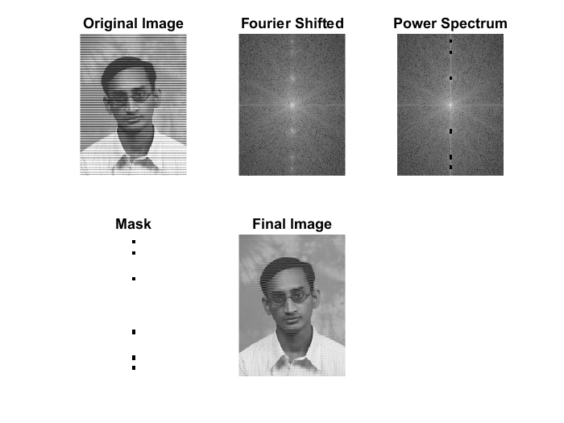
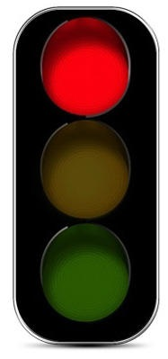
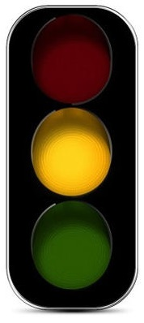
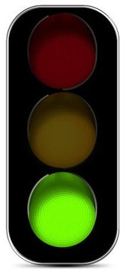
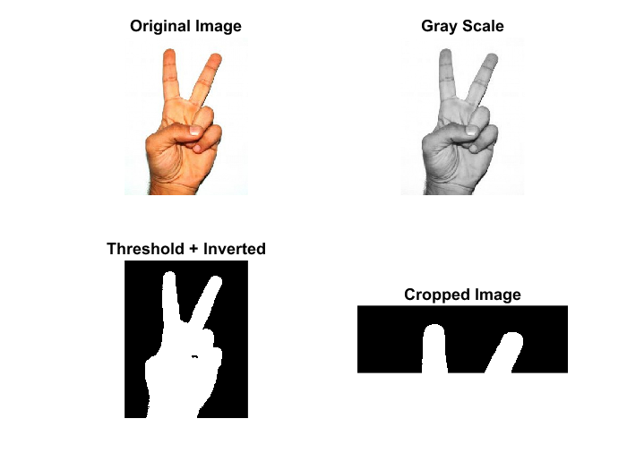
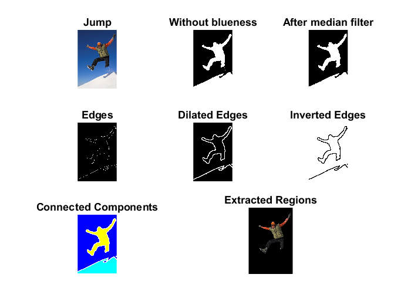

# Remove Periodic Noise

```matlab
% Remove Periodic Noise

% Read the image
img = imread('periodic-noise.png');

% Convert the image to double precision, scaling intensity values to the range [0, 1]
i_doubled = im2double(img);

% Compute the 2D Fourier Transform of the double-precision image
fourier = fft2(i_doubled);

% Shift the zero-frequency component of the Fourier transform to the center
% low frequencies at the center and high frequencies at the corners
fourier_shifted = fftshift(fourier);

% Create a binary mask
mask = ones(size(fourier_shifted));

% Paint specific regions in the mask black (set to 0) to exclude them from further processing
% This is done to remove or ignore periodic noise in these specific regions

% Exclude periodic noise pixels
% Y , X
mask(13:20, 119:124) = 0;
mask(40:46, 119:124) = 0;
mask(97:104, 119:124) = 0;
mask(216:225, 119:124) = 0;
mask(274:284, 119:124) = 0;
mask(297:305, 119:124) = 0;

% Element-wise multiplication
multipliedFourier = fourier_shifted .* mask;

% Inverse shift the multiplied Fourier transform
inverse_fourier_shifted = ifftshift(multipliedFourier);

% Compute the inverse Fourier Transform to obtain the final filtered image
inverse_fourier = ifft2(inverse_fourier_shifted);

% Display the original image, Fourier-transformed image, mask, and final filtered image
subplot(2, 3, 1), imshow(img), title('Original Image');
subplot(2, 3, 2), imshow(log(abs(fourier_shifted)), []), title('Fourier Shifted');
subplot(2, 3, 3),imshow(log(abs(multipliedFourier)),[]),title('Power Spectrum');
subplot(2, 3, 4), imshow(mask), title('Mask');
subplot(2, 3, 5), imshow(inverse_fourier), title('Final Image');
```



-----------------------------------------------------------------

# Detect Traffic Light

```matlab
% Detect which light is ON in the traffic light

% Read the image
img = imread('images/traffic3.jpg');
figure, imshow(img);

% Get image dimensions
[height, width, channels] = size(img);

light = 0;
% Loop through the image pixels
for i = 1:height
    for j = 1:width
        % Check for red light
        if img(i, j, 1) > 140 && img(i, j, 2) < 20 && img(i, j, 3) < 20
            light = 1;
            break;
        end
        % Check for green light
        if img(i, j, 1) < 200 && img(i, j, 2) > 200 && img(i, j, 3) < 20
            light = 2;
            break;
        end
        % Check for yellow light
        if img(i, j, 1) > 200 && img(i, j, 2) > 150 && img(i, j, 3) < 20
            light = 3;
            break;
        end
    end
    % Break the outer loop if a light is detected
    if light > 0
        break;
    end
end

% Display the detected light
if light == 1
    disp('Red is ON');
elseif light == 2
    disp('Green is ON');
elseif light == 3
    disp('Yellow is ON');
else
    disp('No valid light detected');
end
```

|  |  |  |

-----------------------------------------------------------------

# Hand Sign Detection

```matlab
% Hand Sign Detection

% Read the input image
img = imread('images/hand1.jpg');

% Convert the image to grayscale
grayImg = rgb2gray(img);

% Binarize the grayscale image with a high threshold
binaryImg = im2bw(grayImg, 0.9);
binaryImg = ~binaryImg;  % Invert the binary image

% Get image dimensions and crop the upper quarter
[h, w, c] = size(img);
newH = h / 4;
cropped = imcrop(binaryImg, [0 0 w newH]);

% Dilation to eliminate noise and combine adjacent white pixels
dilation = imdilate(cropped, ones(3, 3));

% Label connected components in the dilated image
[L, num] = bwlabel(dilation);

% Display original, grayscale, binary, and cropped images
subplot(2, 2, 1), imshow(img), title('Original Image');
subplot(2, 2, 2), imshow(grayImg), title('Gray Scale');
subplot(2, 2, 3), imshow(binaryImg), title('Threshold + Inverted');
subplot(2, 2, 4), imshow(cropped), title('Cropped Image');

% Display the number of connected components (potential hand signs)
disp(['Number of hand signs: ', num2str(num)]);
```



-----------------------------------------------------------------

# Extract Person from Image

```matlab
% extract the person from the image

% Read the input image
img = imread('images/jump.jpg');
figure, subplot(3, 3, 1), imshow(img), title("Jump");


% Separate color channels
redChannel = img(:, :, 1);
greenChannel = img(:, :, 2);
blueChannel = img(:, :, 3);

% Compute blueness
blueness = double(blueChannel) - max(double(redChannel), double(greenChannel));

% Create a binary mask based on blueness threshold
binaryMask = blueness < 25;
subplot(3, 3, 2), imshow(binaryMask), title("Without blueness");


% Apply median filter to the binary mask
binaryMask = medfilt2(binaryMask, [3, 3]);
subplot(3, 3, 3), imshow(binaryMask), title("After median filter");


% Detect edges using Canny edge detector
edgesBW = edge(binaryMask, 'canny');
subplot(3, 3, 4), imshow(edgesBW), title("Edges");


% Dilate the edges for better connectivity
se = strel('square', 5);
edgesBW = imdilate(edgesBW, se);
subplot(3, 3, 5), imshow(edgesBW), title("Dilated Edges");


% Invert the binary mask
binaryMask = ~edgesBW;
subplot(3, 3, 6), imshow(binaryMask), title("Inverted Edges");


% Label connected components in the inverted binary mask
[L, num] = bwlabel(binaryMask);
RGB = label2rgb(L);
subplot(3, 3, 7), imshow(RGB), title("Connected Components");


% Extract and display regions of interest (ROIs) larger than a threshold
[height, width, ~] = size(img);
smallRatio = height * width * 0.002;

for i = 1:num
    currentRegion = uint8(L == i);
    regionSize = sum(currentRegion(:) == 1);

    % Skip small regions
    if regionSize < smallRatio
        continue;
    end

    % Extract and display the region of interest
    regionOfInterest = zeros(size(img));
    regionOfInterest(:, :, 1) = uint8(currentRegion) .* img(:, :, 1);
    regionOfInterest(:, :, 2) = uint8(currentRegion) .* img(:, :, 2);
    regionOfInterest(:, :, 3) = uint8(currentRegion) .* img(:, :, 3);
end

subplot(3, 3, [8, 9]), imshow(uint8(regionOfInterest)), title("Extracted Regions");
```

